# 🛒 Full Stack E-Ticaret Uygulaması

Bu proje, Java 21 (Spring Boot), React, MySQL ve JWT kullanılarak geliştirilmiş tam işlevli bir e-ticaret uygulamasıdır. Kullanıcılar ürünleri filtreleyebilir, arayabilir, kategorilere göre inceleyebilir, sepet yönetimi yapabilir ve sipariş verebilir.

## 🚀 Özellikler

### 👤 Kullanıcı İşlemleri
- JWT tabanlı güvenli giriş ve kimlik doğrulama
- Kayıt olma ve giriş yapma
- Beğenilen ürünler listesine ekleme ve silme
- Sipariş geçmişi görüntüleme

### 🛍️ Ürün ve Kategori Yönetimi
- Ürünleri kategoriye göre listeleme
- Ürün arama ve filtreleme
- Kampanyalı ürünleri ayrı olarak listeleme

### 🛒 Sepet İşlemleri
- Ürünü sepete ekleme
- Sepetten ürün çıkarma
- Sepetteki ürün adedini artırma/azaltma
- Sipariş oluşturma

## 🛠️ Kullanılan Teknolojiler

### Backend
- Java 21
- Spring Boot
- Spring Security (JWT)
- Spring Data JPA
- MySQL
- Lombok
- Swagger/OpenAPI

### Frontend
- React
- React Redux Toolkit
- Axios
- React Router
- Redux persist
- Material UI

### Diğer
- MySQL veritabanı

##Proje Görselleri
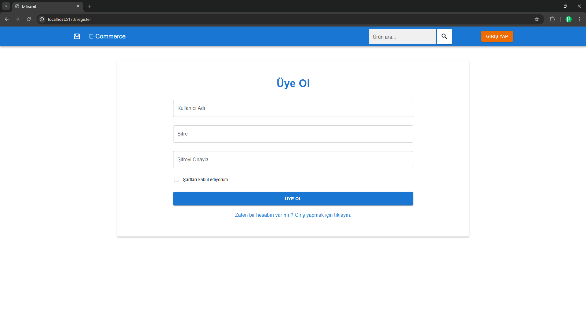
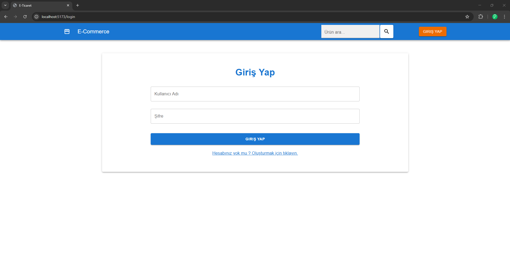
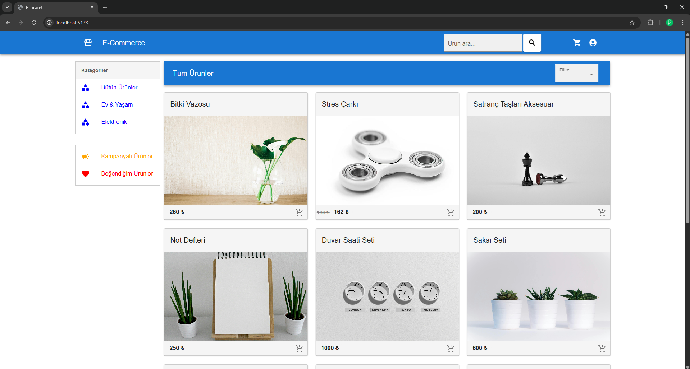
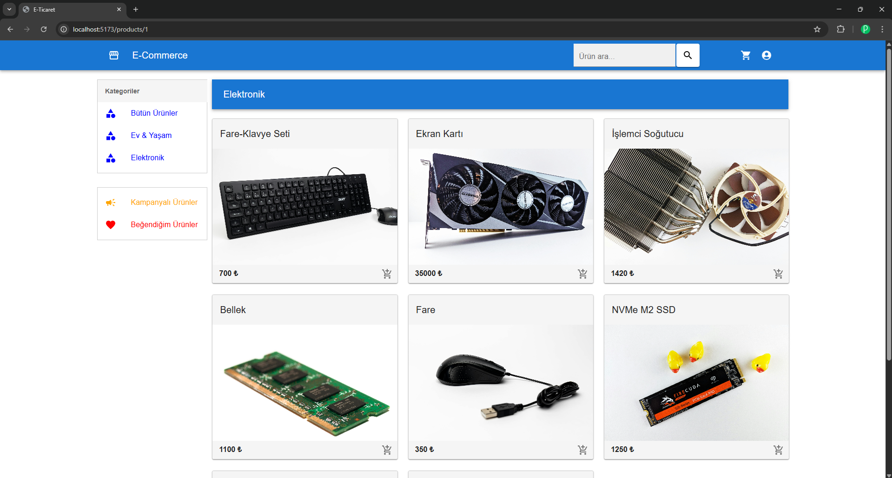
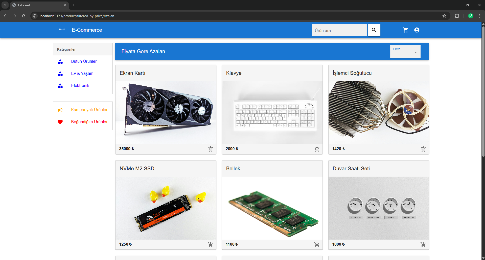
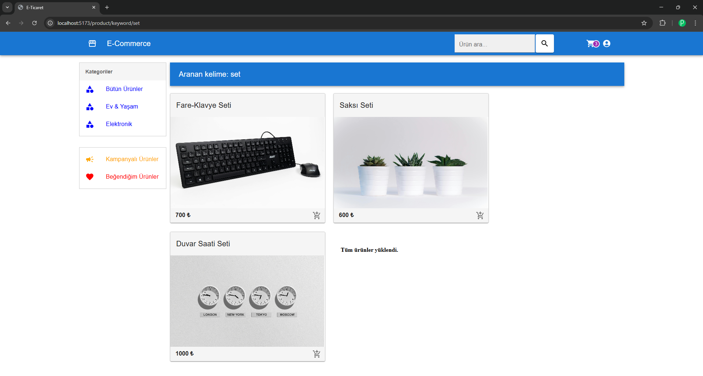
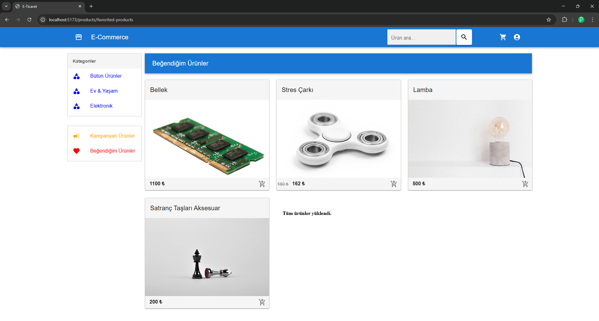
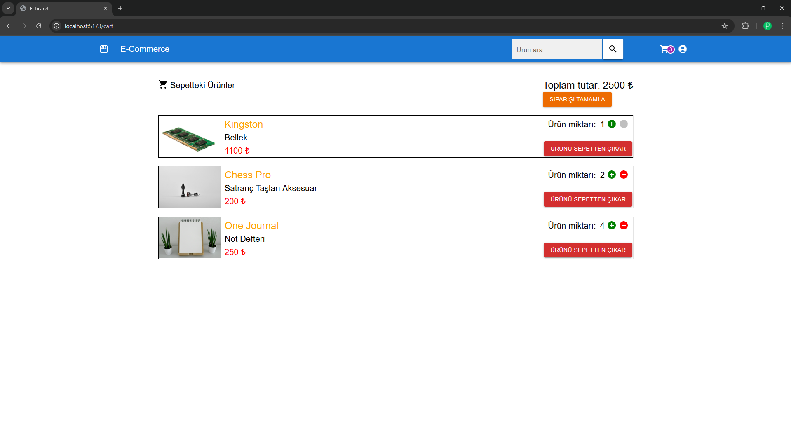
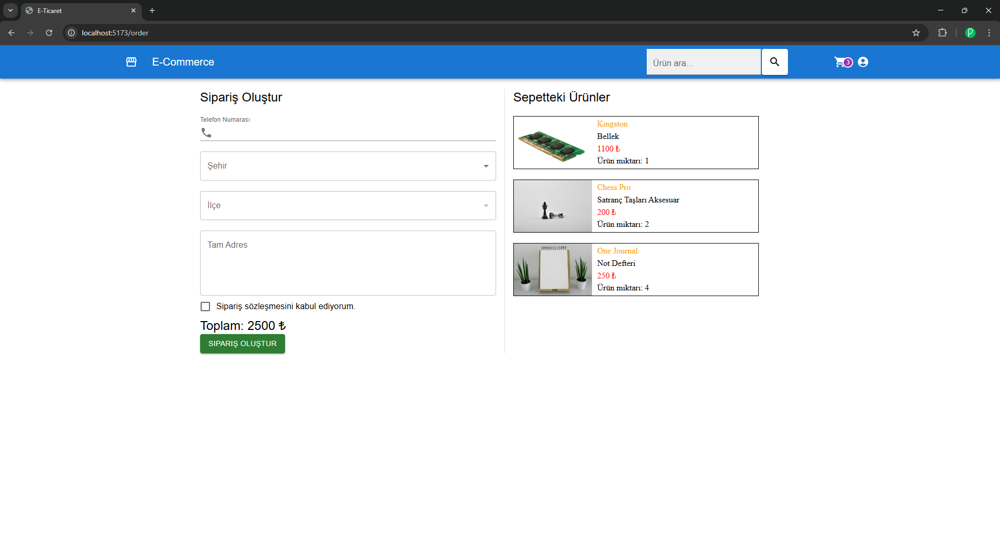
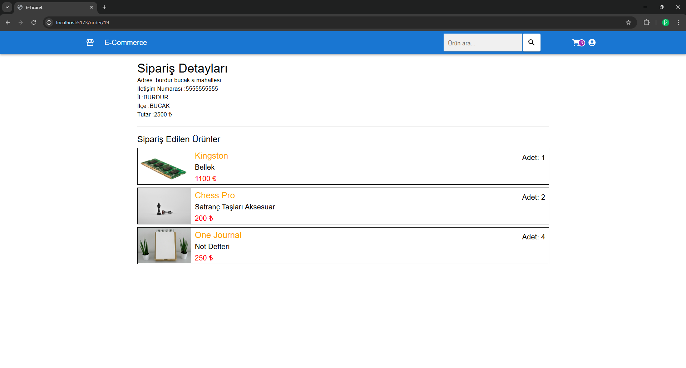
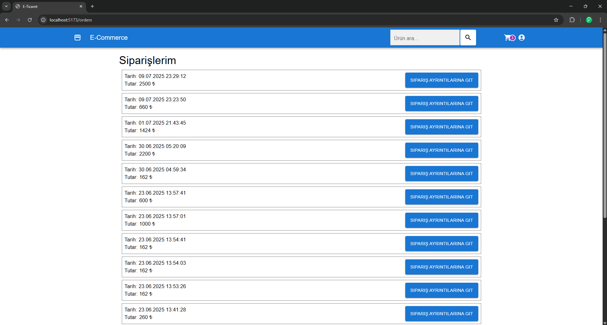
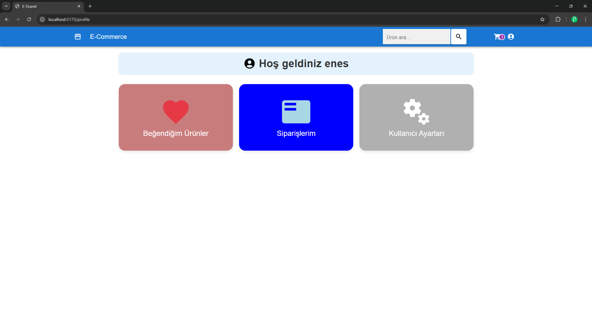

## 🔧 Kurulum

### 1. Backend

```bash
# Projeyi klonla
git clone https://github.com/enesdernek/Full-Stack-E-Commerce-Project.git
cd backend/ecommerce

# application.properties veya application.yml dosyasında MySQL ayarlarını yap
# Örnek:
spring.datasource.url=jdbc:mysql://localhost:3306/eticaret
spring.datasource.username=root
spring.datasource.password=parolan

# Maven ile derle ve çalıştır
./mvnw spring-boot:run

# Frontend dizinine gir
cd frontend/ecommerce

# Gerekli paketleri yükle
npm install

# React uygulamasını başlat
npm start


